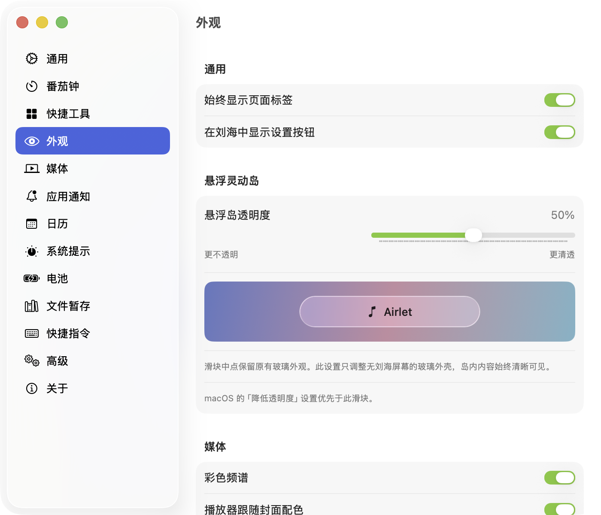

# Airlet

Airlet 是一款原生 macOS 灵动岛应用。它为带刘海和外接无刘海显示器提供各自合适的小岛样式，并把媒体、日历、专注计时和常用系统工具放在菜单栏附近。

**当前版本：v1.1.1（build 305）** · **要求：macOS 15.0 或更新版本、Apple Silicon**

[下载 Airlet v1.1.1 DMG](https://github.com/eDouFuRu/Airlet_private/releases/download/v1.1.1/Airlet-1.1.1.dmg)（仅仓库成员可访问）

## 灵动岛与显示器

- 内置刘海屏保留贴合刘海的原生小岛。
- 外接无刘海屏采用独立悬浮胶囊：内容不受摄像头区域限制，悬停显示，停留达到设置的延迟后展开。
- 无刘海屏默认自动隐藏，可在「设置 → 通用」关闭。菜单栏高度会按每块屏幕分别匹配。
- 无刘海屏的玻璃清透程度可在「设置 → 外观 → 悬浮岛透明度」连续调节；50% 保留原有外观，左侧更实，右侧更透。设置会立即应用到收起胶囊、展开面板和外侧按钮。
- macOS 26 及以上使用系统 Liquid Glass；macOS 15–25 使用系统材质回退。用户反馈 v1.1.0 在 macOS 27 上的观感与 macOS 26 相同，因此不依赖系统升级来改变透明度。新版滑块仍需在 macOS 27 上复测。

## 功能

- **音乐与歌词**：控制当前播放器、显示同步歌词和专辑封面；收起时只占一行。
- **日历**：查看日程、提醒事项和日期热力图。
- **番茄钟**：专注与休息计时、暂停恢复、离线结算、统计和热力图。
- **系统提示**：显示音量、亮度和电源状态。
- **快捷工具**：按需选择工具，包括截屏、录屏、计时器、闹钟、亮度和音量控制。
- **文件暂存**：暂存文件、截图和剪贴板图片；可拖放整理。
- **通知**：选择要显示的应用通知，并按应用配置内容预览。

## 下载与安装

1. 下载上方 DMG，打开后将 Airlet 拖到「应用程序」。
2. 本版本使用项目本地自签名证书，未经过 Apple 公证。首次打开若被 Gatekeeper 拦截，请到「系统设置 → 隐私与安全性」允许打开，再启动 Airlet。
3. 首次使用相关功能时，按系统提示授予辅助功能、屏幕录制、日历或提醒事项权限。

发布包为 Apple Silicon 构建。下载页面同时提供 SHA-256 校验值和详细安装说明。

## 从源码构建

需要 Xcode 26 或更新版本。打开 boringNotch.xcodeproj，选择 NotchIslandNext scheme。开发机签名和本地安装步骤见 [LOCAL-SIGNING.md](LOCAL-SIGNING.md)。

在具有项目签名证书的开发机上，可执行 **bash scripts/build.sh Debug** 进行 Debug 构建，或执行 **bash scripts/package-release.sh** 生成 Release 构建和 DMG。Release 包要求本地签名证书；私钥不会存放在仓库中。打包产物写入被 Git 忽略的 dist/ 目录。

## 项目与验证

本版本以 macOS 26.6.2、Xcode 26 为开发基准，SwiftPM 的 592 项测试已通过。透明度滑块及其预览已在外接无刘海屏的运行窗口中验证；macOS 27 上的新滑块效果仍需复测。

- [Liquid Glass 实现与验证记录](LIQUID-GLASS-VALIDATION.md)
- [使用和工程说明](README-Island.md)
- [设置验收矩阵](SETTINGS-VERIFICATION.md)
- [系统 HUD 验收记录](HUD25D-VALIDATION.md)
- [系统工具与应用通知能力](SYSTEM-TOOLS-CAPABILITIES.md)

## 上游与许可

Airlet 基于 [TheBoredTeam/boring.notch](https://github.com/TheBoredTeam/boring.notch) v2.7.3，遵循 [GPL-3.0](LICENSE)。仓库保留上游 Git 历史和第三方声明。
